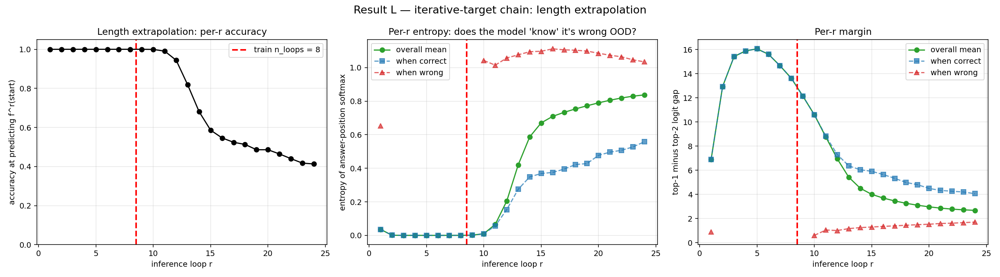
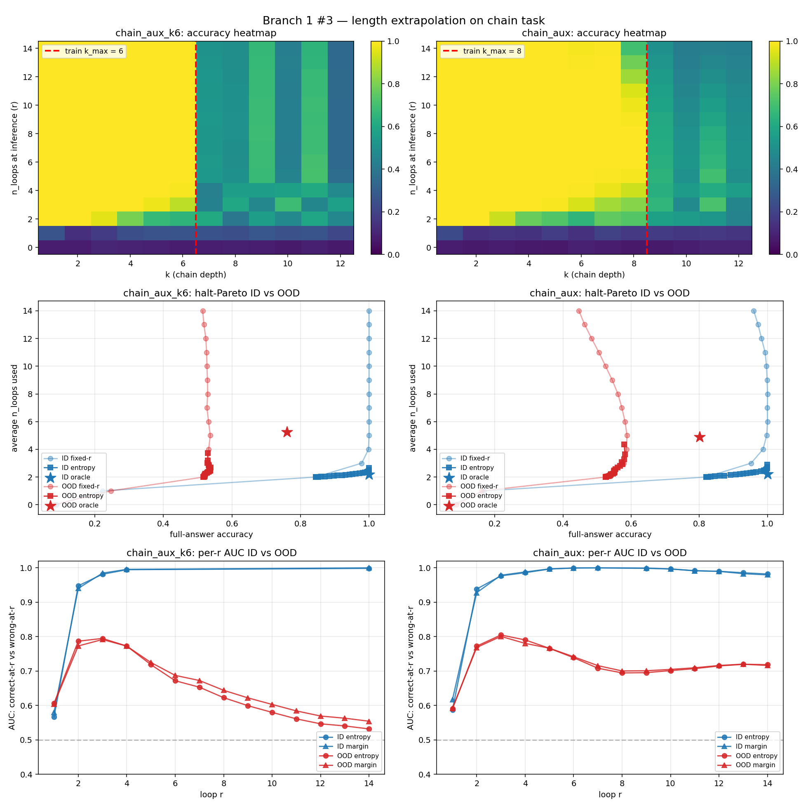

# 1. Length extrapolation is a supervision property, not an architecture property

## The question

A recurrent-depth transformer is a single block looped *r* times. Train it
with the loop run *r_train* times. At inference, can you run it *r > r_train*
times and get *more* reasoning out of the extra loops — or does it break?

The literature treats this as an architectural question ("does the
architecture extrapolate?"). The experiments here show it is almost entirely
a **supervision** question.

## Setup

A clean algorithmic task with tunable per-step depth: **pointer-chain
lookup**. Given a permutation table and a start symbol, apply the table *k*
times. The answer after *k* hops requires exactly *k* sequential
table-lookups — there is no width shortcut (verified: width cannot
substitute, even with auxiliary loss, the no-aux model plateaus at ~75% for
k ≥ 7 at any width).

Two supervision regimes on the *same* looped architecture:

| regime | loss | what it teaches |
|---|---|---|
| **per-answer** | cross-entropy on the final loop only, target = f^k(start) | *terminate* at the trained depth |
| **iter-target** | cross-entropy at every loop r, target = f^r(start) | *iterate*: loop r should hold the r-step partial result |

No depth token, no architectural change. Only the loss differs.

## Result

Trained at `n_loops=8`, evaluated by running the loop out to r=24:

| supervision | acc @ r=8 (trained) | acc @ r=15 | acc @ r=24 (3×) |
|---|---|---|---|
| per-answer | 1.00 | walls — collapses past r=8 | ~0 |
| **iter-target** | **1.00** | **1.00** | **0.886**, calibrated confidence |

Per-answer supervision teaches the model that "computation ends at loop 8."
Per-step supervision teaches "loop r = state after r steps," which is a
*recurrence relation the model can keep applying.* Same weights-tied block,
opposite extrapolation behavior. The lever is the loss, not the net.

## Why — and the falsification test

If iter-target worked by magic it would work on *any* per-step rule. It does
not, and the boundary is informative.

**Claim:** iter-target generalises beyond trained depth **only when the
per-step update is position-invariant** — i.e. loop *r*'s output is a
function of the *state*, not of the loop index *r* itself.

- **Chain** (`state[r+1] = table[state[r]]`): position-invariant. The rule at
  loop 50 is identical to the rule at loop 3. → extrapolates.
- **Parity** ("XOR in the bit at position *r*"): the rule at loop *r*
  explicitly depends on *r*. To extend it the model would need an unbounded
  counter it was never trained to maintain. → **walls exactly at trained
  depth**, as predicted.

The parity experiment is the falsification test. It passes: parity walls,
chain extrapolates, and the discriminating variable is exactly
position-invariance. This converts "the model extrapolates sometimes" into a
**predictive rule** for *which* tasks will extrapolate under this recipe
(table-lookup ✓, ListOps reduction ✓, modular affine ✗ — the per-step rule
must fit in ≤1 block of computation).

## Robustness

Noise injection during training (perturb the looped hidden state with
probability ~0.5) pushes the graceful-decay region further: it stops the
trajectory from over-fitting to the exact trained depth and keeps per-step
displacement well-conditioned. This "R recipe" is a one-line change with
outsized effect on the extrapolation range.

## Why this matters

Length generalization is one of the central open problems in
reasoning-capable models. The result here is not "looped transformers
extrapolate" — it's that **whether they extrapolate is set by a single
training-recipe choice with a clean, tested mechanistic boundary.** That is a
more useful and more falsifiable statement than an architecture claim.

Reproduction: pointer-chain generator + looped transformer (`src/model.py`,
arch=`looped`), iter-target = mean of per-loop cross-entropy with target
`f^r(start)`; per-answer = cross-entropy on loop `n_loops` only. d=256–1024,
vocab=12–27, batch 256, ~13 min/run on one RTX 5090. Parity control: same
harness, per-step rule replaced with index-dependent XOR.
