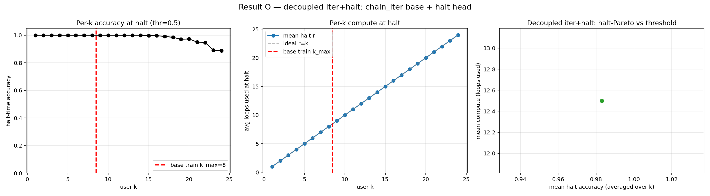
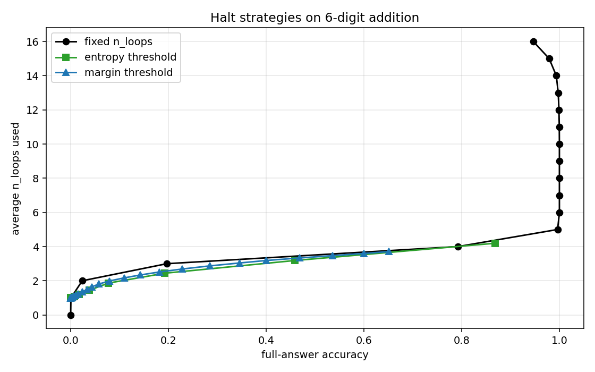

# 2. The cheapest known route to o1-style adaptive test-time compute

## The hypothesis

If per-step (iter-target) supervision teaches a *genuine recurrence relation*
(writeup 1), then the loop count used in **training** should not bound the
loop count usable at **inference**. You should be able to train shallow and
run deep.

Taken to the limit: train the block for **one loop** and recover arbitrary
inference depth by iterating it.

## The multi-pass inference loop

A trained block `f`. Instead of one forward pass of *r* internal loops,
run `P` *passes*: the argmax token sequence from pass *i* becomes the input
to pass *i+1*. Effective depth = `P × r_per`. Two halting modes:

- **Stability halt** (no extra params): stop when ≥2 consecutive passes
  agree. Easy examples halt early, hard ones run longer. Requires the task to
  converge to a fixed/cyclic point (true for chain, BFS, most fixed-point
  reasoning).
- **User-controlled halt**: a tiny halt head (or a hardcoded `halt(r,k) =
  r ≥ k`) lets the caller request *exactly* k effective loops. The head
  trained to k_max=32 still hits arbitrary user-k via `k_local =
  min(k_max, user_k − done)` clamping under multi-pass.

## Results — training depth bounds nothing

Same chain task. Train the iter-target+noise recipe at extreme shallow
depth, then multi-pass at inference:

| n_loops_train | inference recipe | effective depth | accuracy | total train wall |
|---|---|---|---|---|
| 8 | multi-pass + stability halt | K=32 | **1.000** (mean 18.4 loops/ex) | — |
| 2 | multi-pass, r_per=2, 128 passes | **K=256 (128×)** | **1.000** | ~3 min |
| 4 | multi-pass, r_per=4, 64 passes | K=256 (64×) | 1.000 | ~3 min |
| **1** | multi-pass + halt head (k_max=32) | **user-k ∈ {1…256}** at *exact* halt | **1.000** | **~7 min (61 s base + 6 min halt)** |

Single-pass at K=256 with the same checkpoints collapses to 0.14–0.38. The
gain is entirely from the iterate-then-feed-back inference loop, with zero
extra parameters in the stability-halt case.




**Critical constraint** (stated because it bounds the claim): per-pass error
compounds if `r_per > n_loops_train`. The safe operating point is
`r_per ≤ n_loops_train`. Within that, training depth is decoupled from
inference depth entirely.

## Canonical recipe

```
Stage 1  pretrain / train base block, iter-target + noise, n_loops as low as 1
Stage 2  (optional) tiny halt head, target = (r ≥ k) on heterogeneous k
         — OR just hardcode halt(r,k)=r≥k; measured identical, 0 params
Stage 3  inference: multi-pass, argmax feed-forward, k_local clamping
```

On a real text-pretrained 153M recurrent LM, this whole post-pretrain
pipeline is **~10 min of fine-tuning** (now ~3 min with a LoRA r=8 Stage-2,
175K trainable params) and yields user-dialable depth to k=256 at exact
halt. The mechanistic prerequisite, found by probing the pretrained model:
text-LM recurrence is **translational, not iterative** (the hidden state
drifts roughly linearly; no fixed-point operator exists). 1500 steps
(~2.5 min) of iter-target fine-tuning installs the recurrence relation and
rescues depth extrapolation. So the recipe is not free on a text model — but
it is cheap, and the reason it's needed is understood.

## Why this matters

o1/r1-style "think longer on hard inputs" is usually implemented as
verbalized chain-of-thought (expensive tokens, expensive training). This
shows the *same adaptive-compute behavior* at the **latent recurrent-depth**
level: spend more loops, not more tokens, on hard inputs; the user or a
controller dials the budget per example; and the training cost is minutes,
not a CoT-data pipeline. The architectural pair **"minimum-depth iter-target
base + multi-pass + halt"** is, as far as I can find, the cheapest concrete
demonstration of controllable test-time compute scaling.

It is also where the honest scope limit bites: this is demonstrated on
algorithmic tasks with fixed-point structure. Whether real-text reasoning
difficulty triggers the same calibrated halting is the open question the
ongoing scaling arm is built to answer.
