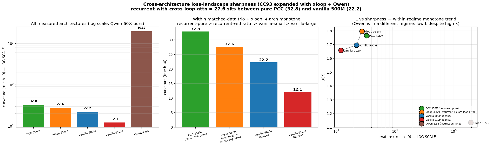
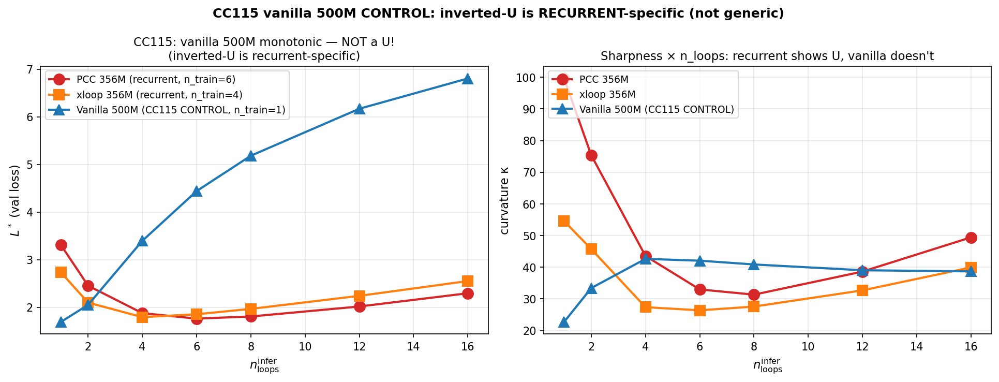
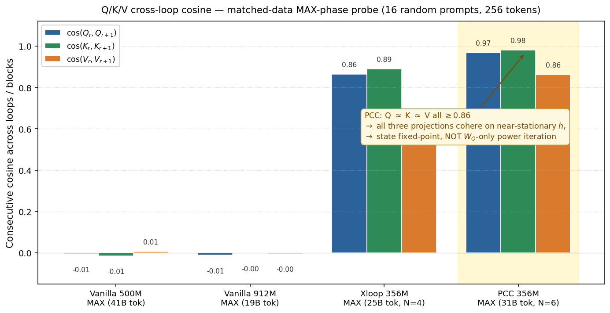

# 8 — Cross-architecture, matched-data: what survives at real-text scale

Writeups 1–7 are controlled, synthetic, and small (d ≤ 1280). This one is the
real-text scaling arm: four architectures pretrained on the **same 50B-token
canonical mix** (FineWeb-Edu + DCLM + Cosmopedia + Stack-Edu + OpenWebMath +
NuminaMath-CoT), then compared head-to-head.

| architecture | shape | params | tokens (MAX) |
|---|---|---:|---:|
| PCC 356M | 2 prelude + 1 core ×6 + 2 coda | 355.9M | 30.95B |
| xloop 356M | PCC + cross-loop attention, N=4 | 355.9M | 24.77B |
| vanilla 500M | dense, L=8 | 507.7M | 41.40B |
| vanilla 912M | dense, L=16 | 912.5M | 19.11B |

**Caveat stated up front:** the pretrains are *not* token-matched (compute
constraints during pretraining). Vanilla 500M saw 1.67× more tokens than
xloop. Every cross-architecture number below carries this confound; a fully
token-matched 4-architecture retrain is the single most important follow-up.

---

## 8.1 The headline is a quantified negative

At this scale, **no recurrent variant beats the matched dense baseline beyond
the noise of pretraining itself.** We measured GSM8K-1319 at seven checkpoints
of the *same* vanilla 500M run (≈32–45B tokens):

> per-wave variance = **2.48% ± 0.60pp** (range [1.82%, 3.41%])

Against this band, the cross-architecture differences are not significant:
xloop is +1.7σ above vanilla's mean (inside the range of vanilla's own best
wave), PCC is +0.4σ. The methodological lesson is the transferable one:
**before claiming architecture A beats architecture B on a single snapshot,
measure the per-wave noise band of one training run.** Most single-snapshot
"architecture wins" at this scale do not clear it.

This is independently corroborated by Lu et al. (COLM 2025, mechanistic Huginn
probe: "marginal gains") and MoDr (ICLR 2026, Huginn rumination "architecturally
limited").

## 8.2 Sampling-TTC is the one reasoning signal that clears the band

`results/` — the exception is HARD50 (50 hand-written multi-step word problems),
the only benchmark where an effect exceeds the noise band — and it favours the
*dense* model:

| model | majority @ K=20 | best-of-K @ K=20 |
|---|:---:|:---:|
| **vanilla 500M** | **62%** | **90%** |
| PCC 356M | 52% | 78% |
| xloop 356M | 50% | 78% |

Vanilla 500M's best-of-K=20 (90%) **matches vanilla 912M's best-of-K=100**:
sampling-time compute on the smaller dense model substitutes for 1.8× the
parameters. This is a parameter-efficiency win for *dense + sampling*, not for
recurrence.

## 8.3 The geometric signature of weight-tying (preliminary, confounded)

Recurrent depth carves a **sharper local minimum** than a dense model. Local
curvature κ at the converged minimum, matched MAX-phase snapshots:

| architecture | κ (h=0.02) | val loss L* |
|---|---:|---:|
| PCC 356M | **32.8** | 1.763 |
| xloop 356M | 27.6 | 1.795 |
| vanilla 500M | 22.2 | 1.695 |
| vanilla 912M | **12.1** | 1.657 |

κ decreases monotonically with weight-tying strength, and the sharpest model
(PCC) has the worst LM loss — exactly what flat-minima theory predicts. **This
is correlational, not causal**: the token-budget mismatch above is not
controlled out, so we report it as a geometric observation, not a mechanism.

The same curvature also has a **recurrent-specific U-shape** over inference
depth: fix the checkpoint, sweep `n_loops`, and recurrent models bottom out at
their *trained* depth and sharpen in either direction, while a dense control
grows monotonically (L*: 1.69 → 6.78). Walking away from trained depth on a
dense model is pure loss inflation; on a recurrent model it walks out of a
clean basin.

## 8.4 Mechanism: the hidden state reaches a fixed point, not a Q-only collapse

Writeup 4 left the single-pass mechanism open. The cross-architecture probe
adds a clean datapoint. Apply the *same* (architecturally shared) W_Q, W_K, W_V
to the hidden states `h_r` across loops and measure consecutive cosine:

| checkpoint | cos(Q_r,Q_{r+1}) | cos(K) | cos(V) |
|---|:---:|:---:|:---:|
| vanilla 500M (distinct blocks) | −0.005 | −0.014 | 0.006 |
| xloop 356M | 0.864 | 0.889 | 0.618 |
| **PCC 356M** | **0.968** | **0.980** | **0.862** |

For vanilla, distinct blocks project onto orthogonal subspaces (cosine ≈ 0).
For PCC, **all three projections cohere simultaneously** at high cosine. This
falsifies the simplest alternative — that this is W_Q power iteration onto its
dominant singular vector — because W_K and W_V have different spectra and would
*not* collapse in lockstep. The only reading consistent with Q, K, *and* V all
cohering is that **`h_r` itself has reached a near-fixed point of the nonlinear
map `h_{r+1} = Block(h_r)`** by loop ≈ 3, after which every linear projection
is necessarily near-constant. Effective state depth ≪ N. This is also why
loops past the trained depth add no new information in single-pass.

## 8.5 Anchor against the published baseline

`lm-eval-harness` (n=400/task) vs Huginn-3.5B's published numbers:

| model | params | ARC-E | ARC-C | HellaSwag | Winogrande |
|---|---:|:---:|:---:|:---:|:---:|
| PCC 356M | 356M | 51.5 | 26.8 | 33.7 | 53.5 |
| vanilla 912M | 912M | 57.5 | 30.2 | 40.8 | 56.5 |
| Huginn-3.5B (published, r=32, 800B tok) | 3.5B | **69.9** | **38.2** | **65.2** | **59.4** |

None of our matched-data checkpoints reaches Huginn's published level. The gap
is dominated by **training-token budget** (Huginn: 800B; ours: 25–45B,
20–30× less), not architecture. We make no claim to refute the published
Huginn numbers — we did not test at that scale.

---

## Bottom line

At academically attainable scale (≤1B params, 25–45B tokens), the
parameter-efficiency thesis is **not visible above pretraining noise**, and the
strongest reasoning signal we can measure favours dense + sampling-TTC. The
recurrent-specific geometry (sharper basin, U-curve, state fixed-point) is real
and measurable but correlational at this snapshot. Taken with writeups 1–7, the
picture is consistent: **recurrence is a post-training mechanism for
position-invariant per-step tasks, not a competitive pretraining architecture
at this scale.** Whether that survives a token-matched retrain — or frontier
scale — is the open question.
